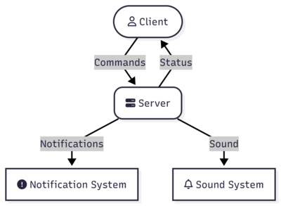

# Tomat 

[](https://github.com/jolars/tomat/actions/workflows/build-and-test.yml)
[](https://codecov.io/gh/jolars/tomat)
[](https://opensource.org/licenses/MIT)
[](https://crates.io/crates/tomat)

Tomat ("tomato" in Swedish 🇸🇪) is a Pomodoro timer for Linux, designed for
seamless integration with waybar and other status bars.

## Features

- **⚙️ Easily Configurable**: Persistent defaults via TOML configuration
- **⚡ Architecture**: Client-server architecture that survives service restarts
- **📊 Flexible Ouput**: Multiple output formats to support waybar, polybar, and
  others
- **📱 Notifications**: Built-in desktop and sound notifications

## Quick Start

```bash
# Install from crates.io
cargo install tomat

# Start daemon and begin working
tomat daemon start
tomat start

# Check status (perfect for waybar)
tomat status
```

## Installation

### Prerequisites

On Linux systems, audio notifications require ALSA development libraries:

```bash
# Ubuntu/Debian
sudo apt-get install libasound2-dev

# Fedora/RHEL
sudo dnf install alsa-lib-devel

# Arch Linux
sudo pacman -S alsa-lib
```

**Note**: Audio will be automatically disabled if ALSA is not available. The
timer will still work normally with desktop notifications only.

### Install from Crates.io

```bash
cargo install tomat
```

### Quick Setup with Systemd

After installing tomat, you can set up the systemd service with a single
command:

```bash
# Install systemd user service (recommended)
tomat daemon install

# Start the daemon
systemctl --user start tomat.service
```

**Alternative manual setup:**

```bash
# Manual systemd setup (if you prefer)
mkdir -p ~/.config/systemd/user
curl -o ~/.config/systemd/user/tomat.service https://raw.githubusercontent.com/jolars/tomat/main/examples/systemd.service
systemctl --user daemon-reload
systemctl --user enable tomat.service
systemctl --user start tomat.service
```

## Basic Usage

### Start Timer

```bash
# Start with defaults (25min work, 5min break)
tomat start

# Custom durations
tomat start --work 30 --break 10 --long-break 20 --sessions 3

# Auto-advance through all phases
tomat start --auto-advance all

# Auto-advance only from work to break (forced breaks)
tomat start --auto-advance to-break

# Auto-advance only from break to work (self-paced work)
tomat start --auto-advance to-work
```

### Control Timer

```bash
tomat status    # Get current status (JSON for waybar)
tomat watch     # Continuously output status updates
tomat toggle    # Pause/resume timer
tomat skip      # Skip to next phase
tomat stop      # Stop timer and return to idle
```

### Daemon Management

```bash
tomat daemon start     # Start background daemon
tomat daemon stop      # Stop daemon
tomat daemon status    # Check daemon status
tomat daemon install   # Install systemd user service
tomat daemon uninstall # Remove systemd user service
```

## Uninstall

To completely remove tomat:

```bash
# Stop and remove systemd service
tomat daemon uninstall

# Remove the binary
cargo uninstall tomat

# Remove configuration (optional)
rm -rf ~/.config/tomat
```

## Configuration

Create `~/.config/tomat/config.toml` to customize defaults:

```toml
[timer]
work = 25.0           # Work duration in minutes
break = 5.0           # Break duration in minutes
long_break = 15.0     # Long break duration in minutes
sessions = 4          # Sessions until long break
auto_advance = "none" # Auto-advance mode: "none", "all", "to-break", "to-work"
                      # (boolean true/false also supported for backwards compatibility)

[sound]
enabled = true        # Enable sound notifications
volume = 0.5          # Volume level (0.0-1.0)

[notification]
enabled = true        # Enable desktop notifications
icon = "auto"         # Icon mode: "auto", "theme", or custom path
timeout = 4000        # Notification timeout in milliseconds

[display]
text_format = "{icon} {time} {state}"  # Text display format
# Available placeholders: {icon}, {time}, {state}, {phase}, {session}
# Examples:
#   "{time}"                    -> "25:00"
#   "{phase}: {time} {state}"   -> "Work: 25:00 ▶"
#   "[{session}] {icon} {time}" -> "[1/4] 🍅 25:00"

[hooks]
# Execute custom commands on timer events (optional)
# All hooks support these fields:
#   cmd (required): Command to execute (absolute path recommended)
#   args (optional): Array of arguments, default []
#   timeout (optional): Timeout in seconds, default 5
#   cwd (optional): Working directory, default $HOME
#   capture_output (optional): Capture stdout/stderr for debugging, default false
#
# Available hooks:
#   Phase transitions:
#     on_work_start, on_work_end
#     on_break_start, on_break_end
#     on_long_break_start, on_long_break_end
#   Timer control:
#     on_pause, on_resume, on_stop, on_skip
#
# SECURITY: Hooks execute with daemon's user privileges. Only configure
# trusted commands. Commands are executed directly (no shell), preventing
# injection attacks.
#
# Environment variables passed to hooks:
#   TOMAT_EVENT - Event name (e.g., "work_start", "pause")
#   TOMAT_PHASE - Current phase ("work", "break", "long_break")
#   TOMAT_REMAINING_SECONDS - Seconds remaining in current phase
#   TOMAT_SESSION_COUNT - Current session number
#   TOMAT_AUTO_ADVANCE - Auto-advance mode ("none", "all", "to-break", "to-work")

# Example hooks:
# [hooks.on_work_start]
# cmd = "notify-send"
# args = ["🍅 Work Time", "Focus for 25 minutes"]
#
# [hooks.on_break_start]
# cmd = "playerctl"
# args = ["pause"]
# timeout = 2
#
# [hooks.on_pause]
# cmd = "/home/user/scripts/dim-screen.sh"
# cwd = "/home/user"
```

**💡 Tip**: Copy the complete example config:

```bash
mkdir -p ~/.config/tomat
cp examples/config.toml ~/.config/tomat/config.toml
# Edit as needed
```

### Security Notes

**Hooks execute with daemon's user privileges.** Follow these guidelines:

- ✅ **Config file ownership**: Ensure `~/.config/tomat/config.toml` is owned by
  your user
- ✅ **Never run as root**: Always use `--user` systemd service or run daemon as
  regular user
- ✅ **No shell injection**: Hook commands are executed directly (not via
  shell), preventing injection attacks
- ⚠️ **Validate commands**: Only configure hooks with trusted executables
- ⚠️ **Path safety**: If using `cwd`, ensure the directory exists and is safe

**Threat model**: If an attacker controls your `~/.config` directory, they
already have code execution (via shell rc files, etc.). Hooks don't introduce
new attack vectors beyond standard Unix permissions.

## Waybar Integration

Add to your waybar config (`~/.config/waybar/config`):

```json
{
  "modules-right": ["custom/tomat"],
  "custom/tomat": {
    "exec": "tomat status",
    "interval": 1,
    "return-type": "json",
    "format": "{}",
    "on-click": "tomat toggle",
    "on-click-right": "tomat skip"
  }
}
```

Add CSS styling (`~/.config/waybar/style.css`):

```css
#custom-tomat.work {
  background-color: #ff6b6b;
}
#custom-tomat.work-paused {
  background-color: #ff9999;
}
#custom-tomat.break {
  background-color: #4ecdc4;
}
#custom-tomat.break-paused {
  background-color: #7dd3db;
}
#custom-tomat.long-break {
  background-color: #45b7d1;
}
#custom-tomat.long-break-paused {
  background-color: #74c0db;
}
```

**💡 Tip**: See [`examples/`](examples/) for configuration examples for waybar
and other status bars.

## Output

By default, Tomat provides waybar-optimized JSON output:

```json
{
  "text": "🍅 24:30 ▶",
  "tooltip": "Work (1/4) - 25.0min",
  "class": "work",
  "percentage": 2.0
}
```

Outupt can be styled by using the css classes `work`, `work-paused`, `break`,
`break-paused`, `long-break`, and `long-break-paused`.

The output type can be changed via the `-o` (`--output`) flag, with options
`waybar` (default), `i3status-rs`, and `plain`.

## Documentation

For detailed guides and advanced configuration:

- **[📋 Documentation Index](https://github.com/jolars/tomat/blob/main/docs/index.md)** -
  Complete documentation overview
- **[📁 Examples](https://github.com/jolars/tomat/tree/main/examples)** -
  Ready-to-use configurations (waybar, systemd, etc.)
- **[📖 Configuration Guide](https://github.com/jolars/tomat/blob/main/docs/configuration.md)** -
  Complete configuration options
- **[🔗 Integration Guide](https://github.com/jolars/tomat/blob/main/docs/integration.md)** -
  Waybar, systemd, and notification setup
- **[🐛 Troubleshooting](https://github.com/jolars/tomat/blob/main/docs/troubleshooting.md)** -
  Common issues and solutions

## Examples

### Basic Workflow

```bash
# One-time setup
cargo install tomat

# Daily usage
tomat daemon start
tomat start          # Begin 25min work session
# ... work on your task ...
tomat status         # Check remaining time
tomat toggle         # Take a quick pause
tomat skip           # Move to break early
# ... enjoy your break ...
# Timer automatically suggests when to return to work
```

### Custom Sessions

```bash
# Long focus session
tomat start --work 45 --break 15

# Sprint session with automatic progression
tomat start --work 15 --break 5 --auto-advance all

# Enforced breaks (auto-advance only to break)
tomat start --work 25 --break 5 --auto-advance to-break

# Self-paced work (auto-advance only to work)
tomat start --work 25 --break 5 --auto-advance to-work

# Deep work (no interruptions)
tomat start --work 90 --break 30 --sessions 2

# Return to configured defaults - just run start without flags
tomat start
```

**Note**: Custom durations only apply to the current session. Running
`tomat start` without flags will always use your configured defaults from
`~/.config/tomat/config.toml` (or built-in defaults if no config exists).

## Architecture

Tomat uses a client-daemon architecture with Unix socket communication to allow
fast and reliable interactions, with persistent timer state managed by the
daemon.



- **Daemon**: Runs continuously, manages timer state and notifications
- **Client**: Sends commands via Unix socket
- **Persistence**: Timer survives waybar restarts and system suspend/resume
- **Notifications**: Desktop alerts and optional sound notifications on phase
  transitions

## Contributing

Contributions are welcome! See [CONTRIBUTING.md](CONTRIBUTING.md) for details.
