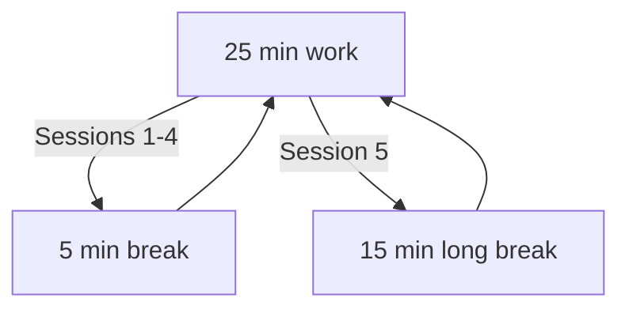
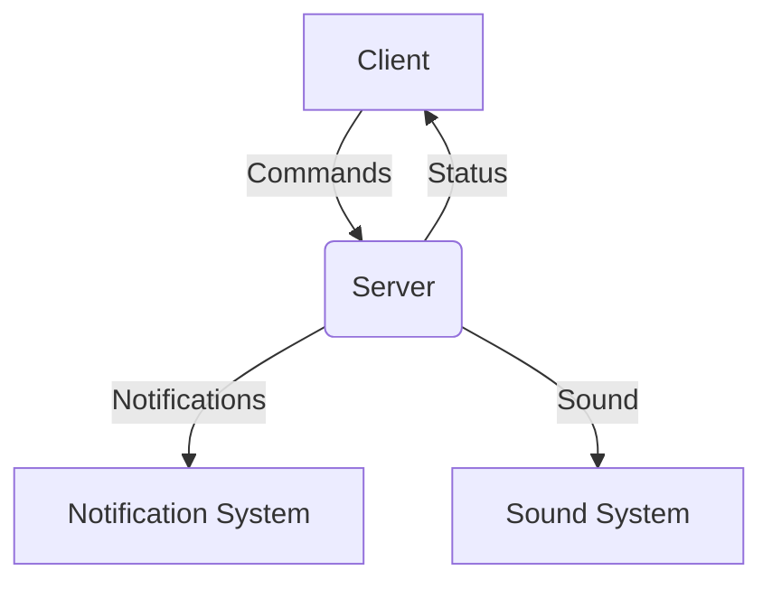

# Getting Started

Tomat ("tomato" in Swedish 🇸🇪) is a Pomodoro timer designed for seamless
integration with Waybar and other status bars. It consists of a background
service (daemon) that manages the timer state and a command-line client to
control the timer and query its status.

If you are new to the Pomodoro technique, it is a time management method that
breaks work into intervals (typically 25 minutes) separated by short breaks.
This approach helps improve focus and productivity by encouraging regular breaks
to rest and recharge.

<style>
  figure {
    text-align: center;
  }
</style>

<figure>



  <figcaption>
    An illustration of the Pomodoro technique.
  </figcaption>
</figure>

## Installation

The easiest way to install Tomat is to download a pre-built binary from the
[releases page](https://github.com/jolars/tomat/releases/latest), or use your
package manager if available:

```bash
# Download pre-built binary (x86_64)
curl -L https://github.com/jolars/tomat/releases/latest/download/tomat-x86_64-unknown-linux-gnu.tar.gz | tar xz
sudo mv tomat /usr/local/bin/

# Or install via Cargo
cargo install tomat

# Or on Arch Linux (AUR)
paru -S tomat-bin
```

See the [installation guide](installation.md) for more options including DEB/RPM
packages, NixOS, and building from source.

## Basic Usage

The next step is to start the daemon:

```bash
tomat daemon start
```

After that, you can start a Pomodoro session by calling

```bash
tomat start
```

You can check the current status of the timer with:

```bash
tomat status
```

Which by default returns a JSON object suitable for Waybar integration:

```json
{
  "text": "🍅 25:00 ⏸",
  "tooltip": "Work (2/4) - 25.0min (Paused)",
  "class": "work-paused",
  "percentage": 0.0
}
```

See the [CLI Reference](../cli-reference.md) for a full list of commands and
options.

## Systemd Service Setup

Most users will want to run the Tomat daemon as a systemd user service so that
it starts automatically on login. Tomat provides a convenience command to
install the service:

```bash
tomat daemon install
```

After that, you can enable and start the service with:

```bash
systemctl --user enable tomat.service --now
```

## Status Bar Integration

The last step is to integrate Tomat with your status bar. To for instance set up
Waybar, simply add the following module to your Waybar configuration:

```json
{
  "modules-right": ["custom/tomat"],
  "custom/tomat": {
    "exec": "tomat status",
    "interval": 1,
    "return-type": "json",
    "format": "{text}",
    "tooltip": true,
    "on-click": "tomat toggle",
    "on-click-right": "tomat skip"
  }
}
```

The documentation features
[integration guides](integration/status-bars/index.md) for several popular
status bars, including Waybar, Polybar, and others.

## Configuration

Tomat can be configured via a configuration file located at
`$XDG_CONFIG_HOME/tomat/config.toml` (usually `~/.config/tomat/config.toml`).
Here is a basic example to get you started:

```toml
[timer]
work = 25.0
break = 5.0
long_break = 15.0
sessions = 4
auto_advance = "none"
```

See the [Configuration Guide](../guide/configuration.md) for a detailed
explanation of all available configuration options

## Architecture

Tomat uses as a client--server architecture consisting of a daemon that runs in
the background and a command-line client that sends commands to the daemon via a
Unix socket located at `$XDG_RUNTIME_DIR/tomat.sock`.

<figure>



  <figcaption>
    Overview of Tomat's architecture.
  </figcaption>
</figure>

The purpose of this is to avoid having the timer be tied to the lifetime of the
calling process, which allows several different clients to interact with the
same timer instance and also prevents the need to save and restore states on
status bar restarts.

The daemon is also responsible for sending
[desktop notification](../configuration/notification.md),
[sound alerts](../configuration/sound.md), and calling
[hooks](../configuration/hooks.md).
